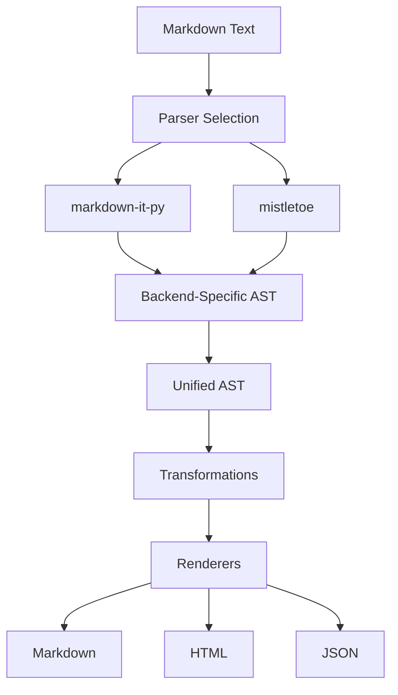

# Core Concepts

Understanding marktripy's architecture is key to using it effectively. This guide explains the fundamental concepts, design decisions, and internal workings.

## Overview

marktripy follows a **unified AST architecture** that abstracts over multiple Markdown parsers while providing a consistent interface for document manipulation.



## The Unified AST

### Node Structure

Every element in a marktripy AST is represented by a node with this structure:

```python
class ASTNode:
    type: str                    # Node type (heading, paragraph, etc.)
    children: List[ASTNode]      # Child nodes
    attrs: Dict[str, Any]        # Attributes (id, class, href, etc.)
    content: str                 # Text content for leaf nodes
    meta: Dict[str, Any]         # Source mapping, parser metadata
    level: int                   # For heading nodes (1-6)
    
    def walk(self) -> Iterator[ASTNode]:
        """Traverse all nodes in document order"""
        yield self
        for child in self.children:
            yield from child.walk()
    
    def find(self, node_type: str) -> List[ASTNode]:
        """Find all nodes of a specific type"""
        return [node for node in self.walk() if node.type == node_type]
```

### Node Types

marktripy recognizes these standard node types:

| Type | Description | Children | Attributes |
|------|-------------|----------|------------|
| `document` | Root document node | Block elements | `{}` |
| `heading` | Heading (H1-H6) | Inline elements | `{id?, class?}` |
| `paragraph` | Text paragraph | Inline elements | `{class?}` |
| `text` | Plain text | None | `{}` |
| `strong` | Bold text | Inline elements | `{}` |
| `emphasis` | Italic text | Inline elements | `{}` |
| `link` | Hyperlink | Inline elements | `{href, title?}` |
| `image` | Image | None | `{src, alt, title?}` |
| `list` | Ordered/unordered list | List items | `{ordered: bool, start?}` |
| `list_item` | List item | Block elements | `{checked?: bool}` |
| `code_block` | Fenced code block | None | `{lang?, info?}` |
| `code_inline` | Inline code | None | `{}` |
| `blockquote` | Block quote | Block elements | `{}` |
| `thematic_break` | Horizontal rule | None | `{}` |
| `html_block` | Raw HTML block | None | `{}` |
| `html_inline` | Raw HTML inline | None | `{}` |

### Example AST Structure

```python
from marktripy import parse_markdown

markdown = """
# Hello World

This is a **bold** statement with a [link](https://example.com).

- Item 1
- Item 2
"""

ast = parse_markdown(markdown)

# The AST structure looks like:
# document
# ├── heading (level=1)
# │   └── text ("Hello World")
# ├── paragraph
# │   ├── text ("This is a ")
# │   ├── strong
# │   │   └── text ("bold")
# │   ├── text (" statement with a ")
# │   ├── link (href="https://example.com")
# │   │   └── text ("link")
# │   └── text (".")
# └── list (ordered=False)
#     ├── list_item
#     │   └── paragraph
#     │       └── text ("Item 1")
#     └── list_item
#         └── paragraph
#             └── text ("Item 2")
```

## Parser Architecture

### Parser Abstraction

marktripy provides a unified interface over multiple Markdown parsers:

```python
from marktripy import Parser

# Default parser (markdown-it-py)
parser = Parser()

# Specific backend
parser = Parser(backend="mistletoe")
parser = Parser(backend="markdown-it-py")

# With extensions
parser = Parser(extensions=["gfm", "math", "kbd"])
```

### Backend Selection

Different backends have different strengths:

| Backend | Strengths | Use Cases |
|---------|-----------|-----------|
| `markdown-it-py` | Plugin ecosystem, CommonMark compliance | Default choice, extensibility |
| `mistletoe` | Clean AST, round-trip fidelity | Document manipulation |
| `markdown` | Mature, stable | Legacy compatibility |

### Parser Configuration

```python
from marktripy import Parser

# Configure parser options
parser = Parser(
    backend="markdown-it-py",
    extensions=["gfm", "kbd"],
    options={
        "html": False,        # Disable raw HTML
        "breaks": True,       # Convert line breaks to <br>
        "linkify": True,      # Auto-convert URLs to links
        "typographer": True,  # Smart quotes and dashes
    }
)

# Parse with configuration
ast = parser.parse(markdown_text)
```

## Rendering Pipeline

### Renderers

marktripy supports multiple output formats:

```python
from marktripy import Parser

parser = Parser()
ast = parser.parse("# Hello **World**")

# Render to different formats
markdown = parser.render_markdown(ast)
html = parser.render_html(ast)
json_data = parser.render_json(ast)
```

### Custom Renderers

Create custom renderers for specialized output:

```python
from marktripy.renderers import BaseRenderer

class PlainTextRenderer(BaseRenderer):
    """Render AST as plain text without formatting"""
    
    def render_text(self, node):
        return node.content
    
    def render_heading(self, node):
        text = self.render_children(node)
        return f"{text}\n{'=' * len(text)}\n"
    
    def render_strong(self, node):
        return self.render_children(node).upper()
    
    def render_emphasis(self, node):
        return f"*{self.render_children(node)}*"

# Use custom renderer
renderer = PlainTextRenderer()
plain_text = renderer.render(ast)
```

## Extension System

### Built-in Extensions

marktripy comes with several built-in extensions:

```python
from marktripy import Parser

# GitHub Flavored Markdown
parser = Parser(extensions=["gfm"])

# Individual GFM features
parser = Parser(extensions=["strikethrough", "tables", "tasklists"])

# Custom extensions
parser = Parser(extensions=["kbd", "math", "footnotes"])
```

### Extension Architecture

Extensions can hook into multiple stages:

```python
from marktripy.extensions import BaseExtension

class CustomExtension(BaseExtension):
    name = "custom"
    
    def extend_parser(self, parser):
        """Modify parser rules"""
        pass
    
    def transform_ast(self, ast):
        """Post-process AST after parsing"""
        return ast
    
    def extend_renderer(self, renderer):
        """Add custom rendering rules"""
        pass
```

### Creating Extensions

Example: Add support for `++text++` → `<kbd>text</kbd>`:

```python
import re
from marktripy.extensions import BaseExtension

class KbdExtension(BaseExtension):
    name = "kbd"
    pattern = re.compile(r'\+\+([^+]+)\+\+')
    
    def transform_ast(self, ast):
        """Convert ++text++ to kbd nodes"""
        for node in ast.walk():
            if node.type == "text" and node.content:
                # Find and replace kbd patterns
                content = node.content
                if self.pattern.search(content):
                    # Replace with kbd nodes
                    self._replace_kbd_syntax(node)
        return ast
    
    def _replace_kbd_syntax(self, text_node):
        """Replace ++text++ with kbd nodes in text node"""
        # Implementation details...
        pass

# Register and use extension
parser = Parser(extensions=[KbdExtension()])
```

## Source Mapping

### Preserving Source Information

marktripy tracks source positions for round-trip conversion:

```python
from marktripy import parse_markdown

markdown = """
# Title

Some text here.
"""

ast = parse_markdown(markdown, preserve_source=True)

for node in ast.walk():
    if hasattr(node, 'meta') and 'source_pos' in node.meta:
        pos = node.meta['source_pos']
        print(f"{node.type} at line {pos['line']}, column {pos['column']}")
```

### Round-trip Fidelity

Preserve formatting during conversion:

```python
from marktripy import parse_markdown, render_markdown

original = """
#    Title with extra spaces    

Text with   multiple   spaces.
"""

# Parse and render back
ast = parse_markdown(original, preserve_whitespace=True)
result = render_markdown(ast)

# Result preserves original spacing
assert result == original
```

## Memory Management

### Efficient Processing

For large documents, use streaming approaches:

```python
from marktripy import StreamingParser

# Process large files efficiently
parser = StreamingParser(chunk_size=1024*1024)  # 1MB chunks

with open('large_document.md', 'r') as f:
    for chunk_ast in parser.parse_stream(f):
        # Process chunk
        process_chunk(chunk_ast)
```

### Node Lifecycle

Understanding when nodes are created and destroyed:

```python
from marktripy import parse_markdown
import weakref

ast = parse_markdown("# Hello")

# Nodes are garbage collected when no longer referenced
node_ref = weakref.ref(ast.children[0])
del ast
# node_ref() may return None after garbage collection
```

## Performance Characteristics

### Parser Performance

Different backends have different performance profiles:

| Backend | Parse Speed | Memory Usage | Round-trip |
|---------|-------------|--------------|------------|
| `markdown-it-py` | Medium | Medium | Good |
| `mistletoe` | Fast | Low | Excellent |
| `markdown` | Slow | High | Poor |

### Optimization Strategies

```python
from marktripy import Parser

# For maximum speed
fast_parser = Parser(
    backend="mistletoe",
    options={"html": False}  # Disable expensive features
)

# For maximum compatibility
compat_parser = Parser(
    backend="markdown-it-py",
    extensions=["gfm"]
)

# For minimum memory
memory_parser = Parser(
    backend="mistletoe",
    options={"lazy_load": True}
)
```

## Error Handling

### Parse Errors

Handle malformed Markdown gracefully:

```python
from marktripy import parse_markdown, ParseError

try:
    ast = parse_markdown(malformed_markdown)
except ParseError as e:
    print(f"Parse failed: {e}")
    print(f"Line {e.line}, column {e.column}: {e.message}")
```

### Validation

Validate AST structure:

```python
from marktripy.validators import validate_ast

ast = parse_markdown(markdown)
issues = validate_ast(ast)

if issues:
    for issue in issues:
        print(f"Warning: {issue}")
```

## Best Practices

### Choosing a Backend

1. **Default choice**: Use `markdown-it-py` for most applications
2. **Performance critical**: Use `mistletoe` for speed
3. **Legacy support**: Use `markdown` for compatibility
4. **Extensions needed**: Use `markdown-it-py` for plugin ecosystem

### AST Manipulation

1. **Use `walk()` for traversal**: More efficient than recursion
2. **Check node types**: Always verify before accessing type-specific attributes
3. **Preserve metadata**: Keep source information when possible
4. **Batch transformations**: Apply multiple changes in single pass

### Memory Efficiency

1. **Process in chunks**: For large documents
2. **Release references**: Delete unused nodes
3. **Use generators**: For streaming processing
4. **Profile memory usage**: Monitor for memory leaks

## Next Steps

Now that you understand the core concepts:

1. **Practice [AST Manipulation](ast-manipulation.md)** with hands-on examples
2. **Create [Extensions](extensions.md)** for custom syntax
3. **Use [Transformers](transformers.md)** for common operations
4. **Optimize [Performance](performance.md)** for your use case

The unified AST architecture makes marktripy both powerful and flexible, allowing you to work with Markdown documents at the structural level while maintaining compatibility across different parser backends.