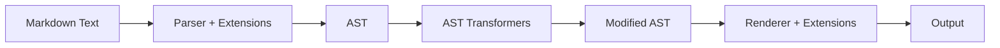

# Extensions System

Learn how to extend Markdown syntax with custom elements, from simple text replacements to complex block-level structures. marktripy's extension system is designed for maximum flexibility and ease of use.

## Extension Architecture

### How Extensions Work

Extensions in marktripy can hook into three stages of processing:

1. **Parser Extension**: Modify the parser to recognize new syntax
2. **AST Transformation**: Post-process the AST after parsing
3. **Renderer Extension**: Add custom rendering for new node types



### Extension Base Class

```python
from marktripy.extensions import BaseExtension

class CustomExtension(BaseExtension):
    name = "custom"  # Unique extension name
    priority = 100   # Processing order (lower = earlier)
    
    def extend_parser(self, parser):
        """Modify parser rules (optional)"""
        pass
    
    def transform_ast(self, ast):
        """Transform AST after parsing (optional)"""
        return ast
    
    def extend_renderer(self, renderer):
        """Add custom rendering rules (optional)"""
        pass
```

## Built-in Extensions

### GitHub Flavored Markdown (GFM)

```python
from marktripy import Parser

# Enable all GFM features
parser = Parser(extensions=['gfm'])

# Or enable specific GFM features
parser = Parser(extensions=['strikethrough', 'tables', 'tasklists'])

markdown = """
# GFM Features

## Strikethrough
~~This text is crossed out~~

## Tables
| Feature | Status |
|---------|--------|
| Tables | ✅ |
| Tasks | ✅ |

## Task Lists
- [x] Completed task
- [ ] Pending task
- [x] Another done task

## Autolinks
Visit https://github.com automatically becomes a link.
"""

ast = parser.parse(markdown)
html = parser.render_html(ast)
```

### Keyboard Extension

```python
from marktripy import Parser

parser = Parser(extensions=['kbd'])

markdown = """
# Keyboard Shortcuts

To copy text, press ++Ctrl+C++.
To paste, use ++Ctrl+V++.
To select all, press ++Ctrl+A++.

You can also use ++Cmd+C++ on Mac.
"""

ast = parser.parse(markdown)
html = parser.render_html(ast)
# Renders: <kbd>Ctrl+C</kbd>, etc.
```

### Math Extension

```python
from marktripy import Parser

parser = Parser(extensions=['math'])

markdown = """
# Mathematical Expressions

Inline math: $E = mc^2$

Block math:
$$
\\sum_{i=1}^{n} x_i = x_1 + x_2 + \\cdots + x_n
$$

Complex equation:
$$
\\frac{\\partial f}{\\partial x} = \\lim_{h \\to 0} \\frac{f(x+h) - f(x)}{h}
$$
"""

ast = parser.parse(markdown)
html = parser.render_html(ast)
```

## Creating Simple Extensions

### Text Replacement Extension

```python
import re
from marktripy.extensions import BaseExtension

class HighlightExtension(BaseExtension):
    """Convert ==text== to <mark>text</mark>"""
    name = "highlight"
    pattern = re.compile(r'==([^=]+)==')
    
    def transform_ast(self, ast):
        for node in ast.walk():
            if node.type == "text" and node.content:
                self._process_highlights(node)
        return ast
    
    def _process_highlights(self, text_node):
        content = text_node.content
        
        # Find all highlight patterns
        matches = list(self.pattern.finditer(content))
        if not matches:
            return
        
        # Split content and create new nodes
        new_nodes = []
        last_end = 0
        
        for match in matches:
            # Add text before highlight
            if match.start() > last_end:
                new_nodes.append({
                    'type': 'text',
                    'content': content[last_end:match.start()],
                    'children': [],
                    'attrs': {}
                })
            
            # Add highlight node
            new_nodes.append({
                'type': 'highlight',
                'children': [{
                    'type': 'text',
                    'content': match.group(1),
                    'children': [],
                    'attrs': {}
                }],
                'attrs': {}
            })
            
            last_end = match.end()
        
        # Add remaining text
        if last_end < len(content):
            new_nodes.append({
                'type': 'text',
                'content': content[last_end:],
                'children': [],
                'attrs': {}
            })
        
        # Replace the text node with new nodes
        self._replace_node_in_parent(text_node, new_nodes)
    
    def extend_renderer(self, renderer):
        """Add HTML rendering for highlight nodes"""
        def render_highlight(node):
            content = renderer.render_children(node)
            return f'<mark>{content}</mark>'
        
        renderer.add_renderer('highlight', render_highlight)

# Usage
parser = Parser(extensions=[HighlightExtension()])

markdown = "This is ==highlighted text== in a sentence."
ast = parser.parse(markdown)
html = parser.render_html(ast)
print(html)  # This is <mark>highlighted text</mark> in a sentence.
```

### Emoji Extension

```python
import re
from marktripy.extensions import BaseExtension

class EmojiExtension(BaseExtension):
    """Convert :emoji_name: to Unicode emojis"""
    name = "emoji"
    
    # Common emoji mappings
    EMOJI_MAP = {
        'smile': '😊',
        'heart': '❤️',
        'thumbsup': '👍',
        'fire': '🔥',
        'rocket': '🚀',
        'warning': '⚠️',
        'info': 'ℹ️',
        'check': '✅',
        'cross': '❌',
        'star': '⭐',
    }
    
    def transform_ast(self, ast):
        for node in ast.walk():
            if node.type == "text" and node.content:
                self._process_emojis(node)
        return ast
    
    def _process_emojis(self, text_node):
        content = text_node.content
        
        # Replace emoji codes
        def replace_emoji(match):
            emoji_name = match.group(1)
            return self.EMOJI_MAP.get(emoji_name, match.group(0))
        
        new_content = re.sub(r':([a-z_]+):', replace_emoji, content)
        text_node.content = new_content

# Usage
parser = Parser(extensions=[EmojiExtension()])

markdown = """
# Great Work! :thumbsup:

This project is :fire:! I :heart: it.

:warning: Remember to save your work!
"""

ast = parser.parse(markdown)
result = parser.render_markdown(ast)
print(result)
```

## Advanced Extensions

### Custom Block Extension

```python
import re
from marktripy.extensions import BaseExtension

class AdmonitionExtension(BaseExtension):
    """Add support for admonition blocks"""
    name = "admonition"
    
    ADMONITION_TYPES = {
        'note': {'icon': 'ℹ️', 'class': 'admonition-note'},
        'warning': {'icon': '⚠️', 'class': 'admonition-warning'},
        'tip': {'icon': '💡', 'class': 'admonition-tip'},
        'danger': {'icon': '❌', 'class': 'admonition-danger'},
        'success': {'icon': '✅', 'class': 'admonition-success'},
    }
    
    def extend_parser(self, parser):
        """Add admonition parsing rules"""
        # This would depend on the specific parser backend
        # For demonstration, we'll use AST transformation
        pass
    
    def transform_ast(self, ast):
        # Look for blockquotes with admonition syntax
        for node in ast.walk():
            if node.type == "blockquote":
                self._check_admonition(node)
        return ast
    
    def _check_admonition(self, blockquote):
        """Check if blockquote is an admonition"""
        if not blockquote.children:
            return
        
        # Check first paragraph for admonition syntax
        first_child = blockquote.children[0]
        if first_child.type == "paragraph" and first_child.children:
            first_text = first_child.children[0]
            if first_text.type == "text":
                match = re.match(r'^!\[(\w+)\]\s*(.*)', first_text.content)
                if match:
                    admonition_type = match.group(1).lower()
                    title = match.group(2) or admonition_type.title()
                    
                    if admonition_type in self.ADMONITION_TYPES:
                        self._convert_to_admonition(
                            blockquote, admonition_type, title
                        )
    
    def _convert_to_admonition(self, blockquote, adm_type, title):
        """Convert blockquote to admonition"""
        config = self.ADMONITION_TYPES[adm_type]
        
        # Change node type
        blockquote.type = "admonition"
        blockquote.attrs = {
            'type': adm_type,
            'title': title,
            'icon': config['icon'],
            'class': config['class']
        }
        
        # Remove the admonition marker from first paragraph
        if (blockquote.children and 
            blockquote.children[0].type == "paragraph" and
            blockquote.children[0].children):
            first_text = blockquote.children[0].children[0]
            if first_text.type == "text":
                # Remove the ![type] part
                first_text.content = re.sub(
                    r'^!\[\w+\]\s*.*?\n?', '', first_text.content
                )
    
    def extend_renderer(self, renderer):
        """Add HTML rendering for admonitions"""
        def render_admonition(node):
            adm_type = node.attrs.get('type', 'note')
            title = node.attrs.get('title', adm_type.title())
            icon = node.attrs.get('icon', '')
            css_class = node.attrs.get('class', f'admonition-{adm_type}')
            
            content = renderer.render_children(node)
            
            return f"""
            <div class="admonition {css_class}">
                <div class="admonition-title">
                    <span class="admonition-icon">{icon}</span>
                    {title}
                </div>
                <div class="admonition-content">
                    {content}
                </div>
            </div>
            """
        
        renderer.add_renderer('admonition', render_admonition)

# Usage
parser = Parser(extensions=[AdmonitionExtension()])

markdown = """
> ![note] Important Information
> This is a note admonition with useful information.
> It can contain multiple paragraphs.

> ![warning] Be Careful!
> This warns about potential issues.

> ![tip]
> Here's a helpful tip without a custom title.
"""

ast = parser.parse(markdown)
html = parser.render_html(ast)
```

### Code Enhancement Extension

```python
import re
from marktripy.extensions import BaseExtension

class CodeEnhancementExtension(BaseExtension):
    """Enhance code blocks with line numbers, highlighting, etc."""
    name = "code_enhancement"
    
    def transform_ast(self, ast):
        for node in ast.walk():
            if node.type == "code_block":
                self._enhance_code_block(node)
        return ast
    
    def _enhance_code_block(self, code_node):
        """Add enhancements to code blocks"""
        language = code_node.attrs.get('lang', '')
        info = code_node.attrs.get('info', '')
        
        # Parse enhancement options from info string
        # Example: ```python {linenos=true, highlight="2-4,7"}
        options = self._parse_code_options(info)
        
        # Apply enhancements
        if options.get('linenos'):
            self._add_line_numbers(code_node)
        
        if options.get('highlight'):
            self._highlight_lines(code_node, options['highlight'])
        
        if options.get('title'):
            code_node.attrs['title'] = options['title']
    
    def _parse_code_options(self, info_string):
        """Parse options from code block info string"""
        options = {}
        
        # Match {option=value, option2=value2} patterns
        option_match = re.search(r'\{([^}]+)\}', info_string)
        if option_match:
            option_string = option_match.group(1)
            for option in option_string.split(','):
                if '=' in option:
                    key, value = option.strip().split('=', 1)
                    options[key.strip()] = value.strip().strip('"\'')
                else:
                    options[option.strip()] = True
        
        return options
    
    def _add_line_numbers(self, code_node):
        """Add line numbers to code content"""
        if not hasattr(code_node, 'content'):
            return
        
        lines = code_node.content.split('\n')
        numbered_lines = []
        
        for i, line in enumerate(lines, 1):
            numbered_lines.append(f"{i:3d} | {line}")
        
        code_node.content = '\n'.join(numbered_lines)
        code_node.attrs['has_line_numbers'] = True
    
    def _highlight_lines(self, code_node, highlight_spec):
        """Highlight specific lines"""
        # Store highlight information for renderer
        code_node.attrs['highlight_lines'] = highlight_spec
    
    def extend_renderer(self, renderer):
        """Enhanced HTML rendering for code blocks"""
        def render_code_block(node):
            language = node.attrs.get('lang', '')
            content = getattr(node, 'content', '')
            title = node.attrs.get('title')
            has_line_numbers = node.attrs.get('has_line_numbers', False)
            
            css_classes = ['code-block']
            if language:
                css_classes.append(f'language-{language}')
            if has_line_numbers:
                css_classes.append('line-numbers')
            
            html = f'<div class="{" ".join(css_classes)}">'
            
            if title:
                html += f'<div class="code-title">{title}</div>'
            
            html += f'<pre><code class="language-{language}">{content}</code></pre>'
            html += '</div>'
            
            return html
        
        renderer.add_renderer('code_block', render_code_block)

# Usage
parser = Parser(extensions=[CodeEnhancementExtension()])

markdown = '''
```python {linenos=true, title="Example Function"}
def fibonacci(n):
    if n <= 1:
        return n
    return fibonacci(n-1) + fibonacci(n-2)

# Calculate first 10 Fibonacci numbers
for i in range(10):
    print(f"fib({i}) = {fibonacci(i)}")
```
'''

ast = parser.parse(markdown)
html = parser.render_html(ast)
```

## Extension Configuration

### Configurable Extensions

```python
from marktripy.extensions import BaseExtension

class ConfigurableExtension(BaseExtension):
    """Extension with configurable options"""
    name = "configurable"
    
    def __init__(self, **options):
        self.options = {
            'default_option': True,
            'custom_value': 'default',
            **options  # Override with user options
        }
    
    def transform_ast(self, ast):
        if self.options['default_option']:
            # Apply transformation based on configuration
            pass
        return ast

# Usage with custom configuration
extension = ConfigurableExtension(
    default_option=False,
    custom_value='custom_setting'
)

parser = Parser(extensions=[extension])
```

### Extension Composition

```python
from marktripy import Parser

# Combine multiple extensions
parser = Parser(extensions=[
    'gfm',                    # Built-in extension name
    HighlightExtension(),     # Custom extension instance
    EmojiExtension(),         # Another custom extension
    AdmonitionExtension(),    # Complex custom extension
])

# Extensions are applied in order
markdown = """
# Document with Extensions

This has ==highlighted== text and :fire: emojis.

> ![tip] Pro Tip
> You can combine multiple extensions!

~~Strikethrough~~ and **bold** text.
"""

ast = parser.parse(markdown)
html = parser.render_html(ast)
```

## Testing Extensions

### Extension Testing Framework

```python
import unittest
from marktripy import Parser

class TestHighlightExtension(unittest.TestCase):
    def setUp(self):
        self.parser = Parser(extensions=[HighlightExtension()])
    
    def test_simple_highlight(self):
        markdown = "This is ==highlighted== text."
        ast = self.parser.parse(markdown)
        html = self.parser.render_html(ast)
        
        self.assertIn('<mark>highlighted</mark>', html)
    
    def test_multiple_highlights(self):
        markdown = "==First== and ==second== highlights."
        ast = self.parser.parse(markdown)
        html = self.parser.render_html(ast)
        
        self.assertEqual(html.count('<mark>'), 2)
    
    def test_no_highlight_in_code(self):
        markdown = "`==not highlighted==` in code."
        ast = self.parser.parse(markdown)
        html = self.parser.render_html(ast)
        
        self.assertNotIn('<mark>', html)

# Run tests
if __name__ == '__main__':
    unittest.main()
```

### Performance Testing

```python
import time
from marktripy import Parser

def benchmark_extension(extension_class, test_markdown, iterations=1000):
    """Benchmark extension performance"""
    
    # Test without extension
    parser_plain = Parser()
    start_time = time.time()
    for _ in range(iterations):
        ast = parser_plain.parse(test_markdown)
    plain_time = time.time() - start_time
    
    # Test with extension
    parser_ext = Parser(extensions=[extension_class()])
    start_time = time.time()
    for _ in range(iterations):
        ast = parser_ext.parse(test_markdown)
    ext_time = time.time() - start_time
    
    overhead = ((ext_time - plain_time) / plain_time) * 100
    print(f"Extension overhead: {overhead:.1f}%")
    print(f"Plain: {plain_time:.3f}s, With extension: {ext_time:.3f}s")

# Benchmark highlight extension
test_text = "This is ==highlighted== text with ==multiple== highlights."
benchmark_extension(HighlightExtension, test_text)
```

## Distribution and Packaging

### Creating Extension Packages

```python
# setup.py for extension package
from setuptools import setup, find_packages

setup(
    name="marktripy-highlight",
    version="1.0.0",
    description="Highlight extension for marktripy",
    packages=find_packages(),
    install_requires=["marktripy>=1.0.0"],
    entry_points={
        'marktripy.extensions': [
            'highlight = marktripy_highlight:HighlightExtension',
        ],
    },
)
```

### Extension Discovery

```python
# Enable automatic extension discovery
from marktripy import Parser

# Auto-discover installed extensions
parser = Parser(auto_discover=True)

# Or discover specific extension types
parser = Parser(discover=['highlight', 'emoji'])
```

## Best Practices

### Extension Development Guidelines

1. **Keep it Simple**: Start with AST transformation, add parser/renderer hooks only if needed
2. **Error Handling**: Always handle malformed input gracefully
3. **Performance**: Minimize regex usage in hot paths
4. **Testing**: Test edge cases and interaction with other extensions
5. **Documentation**: Provide clear examples and configuration options

### Common Pitfalls

```python
# ❌ Don't modify nodes during iteration
for node in ast.walk():
    if node.type == "text":
        # This can break iteration
        del node.parent.children[node.index]

# ✅ Collect nodes first, then modify
text_nodes = [node for node in ast.walk() if node.type == "text"]
for node in text_nodes:
    # Safe to modify
    modify_node(node)

# ❌ Don't create circular references
def bad_transform(ast):
    for node in ast.walk():
        node.parent = ast  # Creates circular reference

# ✅ Use proper parent-child relationships
def good_transform(ast):
    parent_map = build_parent_map(ast)
    # Use parent_map for navigation
```

## Next Steps

With extensions, you can customize marktripy for any use case. Next, explore:

1. **[Transformers](transformers.md)** - Pre-built transformation utilities
2. **[Performance](performance.md)** - Optimize extension performance
3. **[CLI Usage](cli.md)** - Use extensions from command line
4. **[API Reference](api-reference.md)** - Complete extension API documentation

The extension system makes marktripy infinitely customizable while maintaining compatibility with standard Markdown.